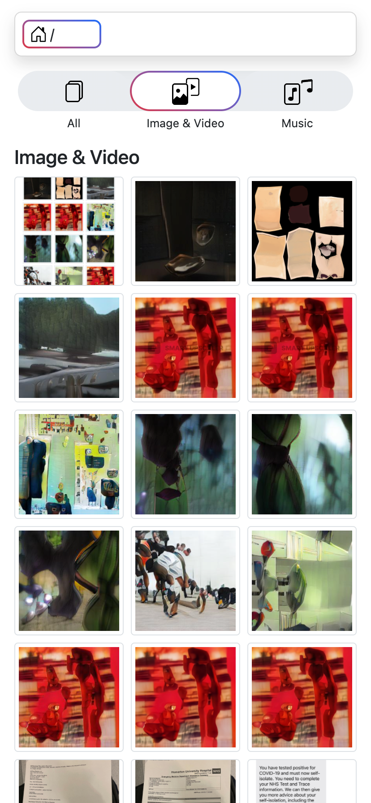
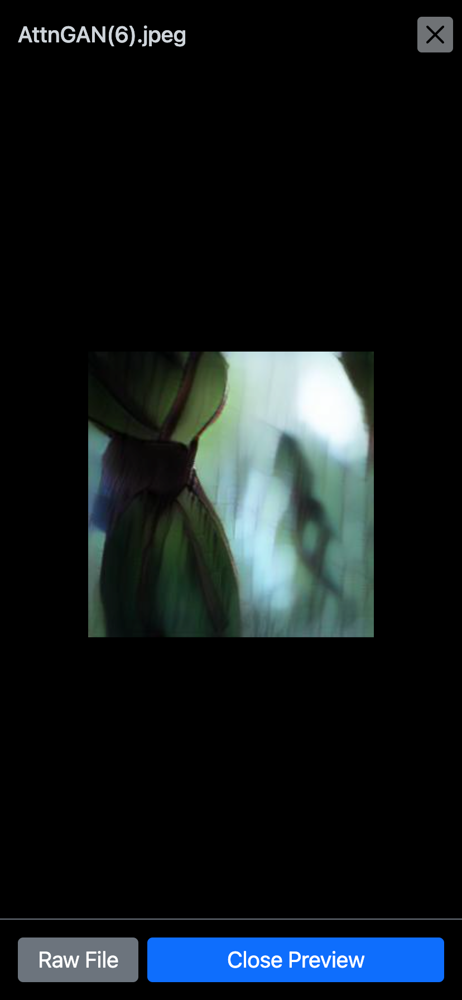
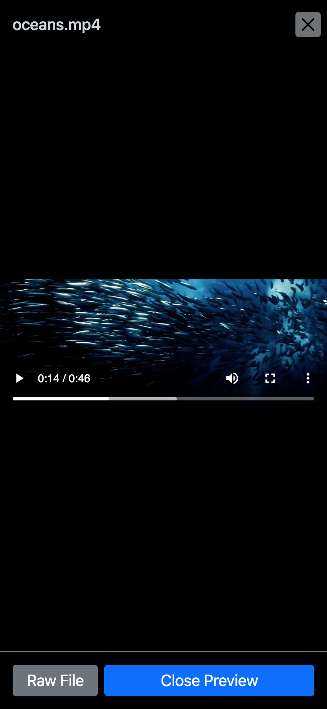
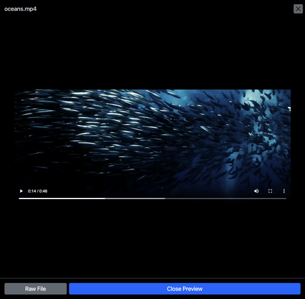

### MVP

- [X] To navigate folders and open files
- [x] To have a breadcrumb navigation bar
- [x] To abbreviate very long folder/file name smartly
- [x] To dynamically load images to preview 
- [x] To highlight certain category of files in current folder

### Nice to have
- [ ] A mp3 player
  - [ ] Loop play.
  - [ ] Skip to next song when Media source could not be decoded. And stop playing when all songs are not playable.
- [ ] To hightlight the last selected file or visited folder. 
- [ ] To have a config yaml.
- [ ] To highlight the previous folder after navigation to upper folder. 
- [ ] To generate thumbnails when entering a gallery folder 
- [ ] A web-based local admin panel and a remote rich media browser.
- [ ] Simple password protection.
- [ ] Prompt to get Admin's confirmation to generate thumbnails of images/vidoes. This sounds unsafe, write operation from html access. 
    1. To resize image to a thumbnail
    2. https://github.com/xfrr/goffmpeg to extract first frame of video
    3. Show a progress of above progress
- [ ] In preview modal, click on the video and show control. 
- [ ] Add a file size sorting option. For now files are sorted with newest modification time to oldest. 
- [ ] Display file info in preview modal, such as Modification Time and File Size.

### Work log

#### 2022-03-16

- Refactor template modules. 

- Update category selector and default list view UI. 

- Init the music player view.

#### 2022-03-15

- Fix video play `.mov` issue. Fix the `video` overflow issue, and improve preview modal UI.

- Now the preview modal has `Prev` and `Next` navigation buttons. 

- Add a chekced-grid background for illustrating image file transparency.

#### 2022-03-14

- Add the preview modal for images and videos in the default view and in the image video view.

| Image Video view  | Preview modal for image | Preview modal for video |
| ------------- | ------------- | ------------- |
|   |  |   | 

Preview modal for Video (Desktop)

#### 2022-03-13

- Add a image video view, with Instagram grid style.
- Updated category selector. 
  - Add Js script to remove class name from body when onload finishes, so the animation/transition will be smooth, and serves as a indicator for fully interacitve page.
  - Use background image css trink to have a multi-color gradient visual effect.

#### 2022-03-09

- Find an elegant approach to make sure Breadcrumb folder pills have a stable width between page navigations. The trailing item in each row will fulfill the spaces until the row end. 
- Add the filter bar, now there are "All", "Image & Video", "Music" three filters for users to click. 

#### 2022-03-08

- Add lazyload for images in vanilla JS, only load images in the current and the next viewport. 
- Add a url query `entryType` to highlight file types in current folder.
[ ] Plans to keep query between page jumps.

#### 2022-03-03

- Add serving static assets style/js/icons.
- Integrate Bootstrap css and icons.

#### 2022-03-01

- Add detection for folder, image, video files.

##### 2022-02-15

- Extract fs.go from Go's offical `http` in order to customize file / dir display.

