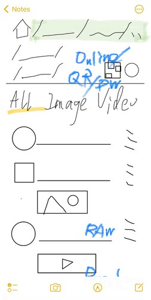
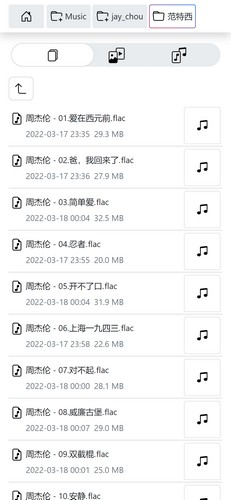
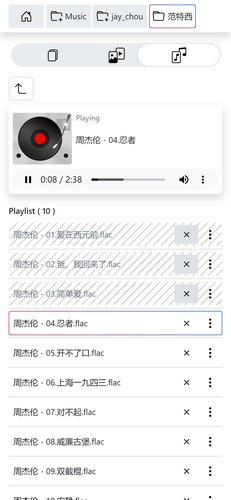
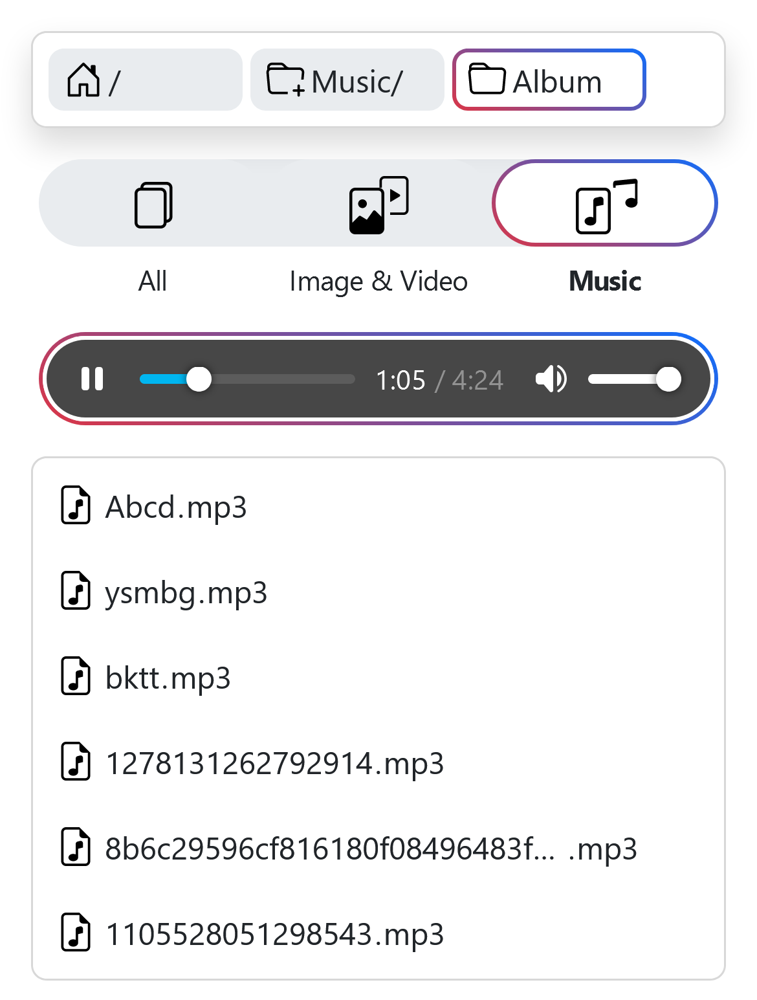
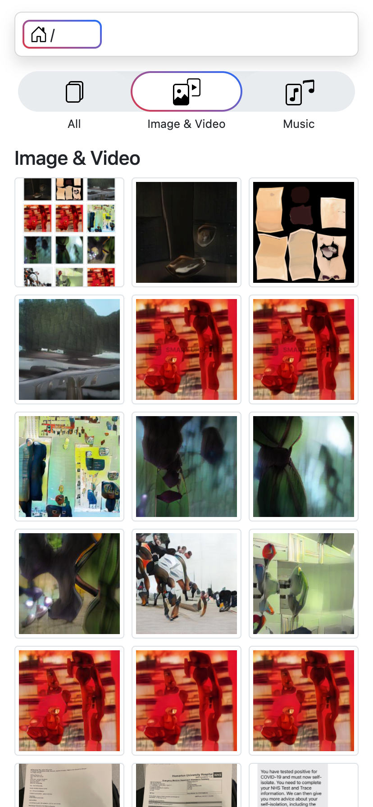
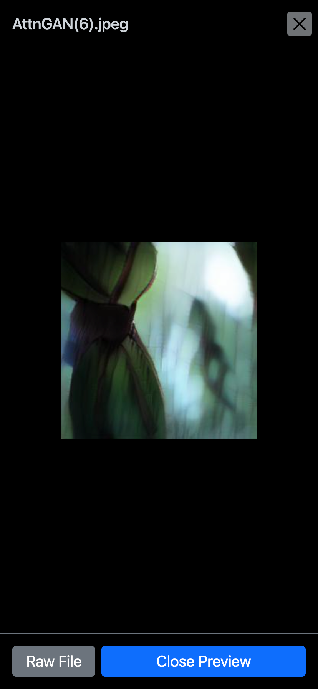
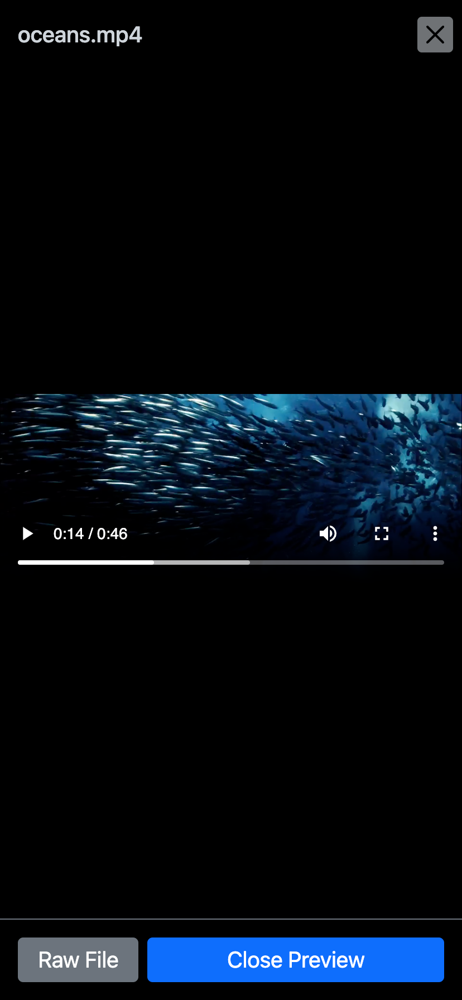
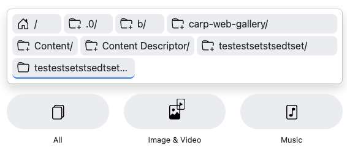

### MVP

| Draft  | Items | 
| ------------- | ------------- | 
|   | ✅ To navigate between folders and check files    ✅ To have a breadcrumb navigation bar   ✅ To display very long folder/file names smartly   ✅ To scroll smoothly when there are huge number of files   ✅ To have smart views for videos, images, and musics   ✅ Add a file size sorting option |

### Nice to have
- [x] A mp3 player
  - [x] Loop play.
  - [x] Skip to next song when Media source could not be decoded. 
  - [x] Stop playing when all songs are not playable.
  - [x] Highlight the current playing track.
- [ ] To highlight the last selected file or visited folder. 
- [ ] To highlight the previous folder after navigation to upper folder. 
- [ ] To have a config yaml.
- [ ] A web-based local admin panel and a remote rich media browser.
- [ ] Simple password protection.
- [ ] To generate thumbnails when entering a gallery folder 
  1. To resize image to a thumbnail
  2. https://github.com/xfrr/goffmpeg to extract first frame of video
  3. Show a progress of above progress
- [ ]: Add QR code in terminal when starting and web/home so mobile phone can scan it to open. 

### Work log

#### 2023-08-03
- [ ] Use channel to load at least 1-level sub folder's info. Otherwise it seems not quite useful.
- [ ] move breadcrumb into frontend. 

#### 2023-07-29
- Add JSON format for directory list metadata. 
- Add a summary of the sub folders (1-level depth).
- Using `React` and `Radix-ui` to build `carp-web`.

#### 2023-07-01
- Separate codes into `carp-server` backend and `carp-web` frontend. 
- Server is a http server to fulfill to page/file requests, and respond folder/file metadata in json format. 
  - Refactor `carp-server/packages/carphttp/fs.go` and rebase it to go 1.20 package. Introduce `fs_deps.go` to solve the dependency issue when customerising `fs.go`.
  - Create `carp-server/public/` folder. This folder will host the compiled `carp-web` javascript and other static assets.
- Web is a pure browser side app to load folder/file metadata and render a list of folders, a grid table of images, and a player for media files. 
  - Using `pnpm` and `vite` because they look compact and fast. 

#### 2023-06-19

- Fix video control bar not working by removeing dummy `source` element.
- Add `Show videos first` and `Show images first` options in `Sort By` droplist. 
- [ ] Sort By active color is still boostrap's default blue.
- [ ] Init players for videos within the viewport for video and image view, and pause the playbacks at their 3 seconds for showing poster images. 
- [ ] Add text viewer and pdf viewer. 

#### 2023-06-13

- Fix the issue of new version Go Template not supporting "\` \`" syntax.
- Update to `videojs` for video playback. 

#### 2022-04-12

- Introduce a vitual dom scrolling library `clusterize.js` and combine with image `lazyload.js` to preview folders with huge number of images or videos. 
Not only very few dom nodes within the view port are created, also the images are lazy loaded. Tested on iOS, Android phone and desktop Chrome, performance tests are improved dramatically for the latter two.
- Improve the skipped track style. Unify the height of primary items for folder, image, music and video.

  | Album Folder - Default View  | Album Folder - Music Player View | 
  | ------------- | ------------- | 
  |   |  |

#### 2022-04-11

- Add Modification Time and Size. 
- Enable localstorage in browser to keep some session level data, for instance playlist skipped tracks. 
- [ ] To add a sorting order of entries. 

#### 2022-04-10

- Add music playlist skip function. The skipped tracks are remarked with text decoration strike through lines and they won't be played. 
- Add loop count and error count for music player. 
- [ ] To add a unique md5 based on file name + file size + modification time, need this to determine whether we need to generate new thumbnails

#### 2022-04-02

- Support music preview modal. Refactor music player, now it supports a playlist or a given play track. Add auto play data attribute for track links.
- Add a dict function in go template.

#### 2022-03-26

- Finaize vinyl recorder player. When the album contains a cover image, e.g. `cover.jpg`, the vinyl recorder will use it automatically.
- Image & Video view loads the thumbnail image in the list. 
- Add a blurred background for image preview button.
- Include SVG directly insert HTML.
 

#### 2022-03-23

- Add a navigation button to upper folder, on the shoulder of file list and above footer. 
- Improve vinyl record player's template and UI.
- Unify the look & feel of different category views. 

#### 2022-03-21

- Finalize preview modal. Refactor navigation buttons so the button has an elegant blink effect when clicked. Rfactor the `video` layout.

#### 2022-03-20

- Integrate css3 vinyl record player.
- Automatically select the best category based on file types in current folder, for instance if most of the files are `mp3`, the view will be in `Music` category rather than `All`
- The player is sticky to the bottom in `Music` view, and when the player list is empty the player is not sticky and stays above the `Other Files` section.
  
  

#### 2022-03-17

- Update the Preview Modal.
- Finish view of music player. Playing track is highlighted in the list. Change the player position to bottom fix.

#### 2022-03-16

- Refactor template modules. 
- Update category selector and default list view UI. 
- Init the music player view.
  
  

#### 2022-03-15

- Fix video play `.mov` issue. Fix the `video` overflow issue, and improve preview modal UI.
- Now the preview modal has `Prev` and `Next` navigation buttons. 
- Add a chekced-grid background for illustrating image file transparency.

#### 2022-03-14

- Add the preview modal for images and videos in the default view and in the image video view.

  | Image Video view  | Preview modal for image | Preview modal for video |
  | ------------- | ------------- | ------------- |
  |   |  |   | 

#### 2022-03-13

- Add an `Image & Video` view, in a Instagram style grid layout.
- Update category selector. 
  - Add Js script to remove class name from body when onload finishes, so the animation/transition will be smooth, and serves as a indicator for fully interacitve page.
  - Use background image css trink to have a multi-color gradient visual effect.

#### 2022-03-09

- Find an elegant approach to make sure each breadcrumb pills hold a stable width between folder jumps. The trailing pill in each row fulfills the space to the row end. 
- Add the category filters, now there are "All", "Image & Video", "Music" three filters for users to click. 

  

#### 2022-03-08

- Add lazyload for images in vanilla JS, only load images in the current and the next viewport. 
- Add a url query `entryType` to highlight file types in current folder.

#### 2022-03-03

- Add serving static assets style/js/icons.
- Integrate Bootstrap css and icons.

#### 2022-03-01

- Add detection for folder, image, video files.

#### 2022-02-15

- Extract fs.go from Go's offical `http` in order to customize file / dir display.

#### 2022-02-01

- Draft UI on commute.

  

